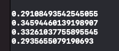
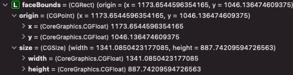
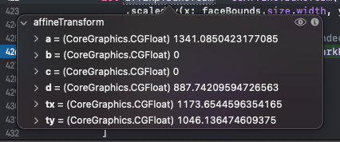
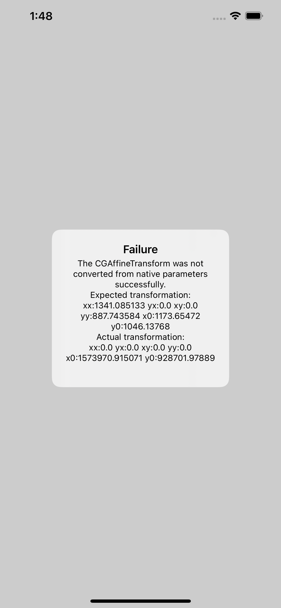

# CGAffineTransform Playground

Playground where a `CGAffineTransform` is converted from swift to c#.

The api used by swift uses a fluent style api:
```swift
let affineTransform = CGAffineTransform(translationX: faceBounds.origin.x, y: faceBounds.origin.y)
    .scaledBy(x: faceBounds.size.width, y: faceBounds.size.height)
```

In c# you cannot perform the same method chain and instead write:
```csharp
var affineTransform = CGAffineTransform.MakeTranslation(x, y);
affineTransform.Scale(width, height, MatrixOrder.Prepend);
```

Whilst writing a proof of concept application I had difficultly writing valid transforms so I thought I'd use this sample to fully understand the c# api as it's not as intuitive as you'd think.

## Swift Sample

This example is provided in a swift playground. The following affine transform is produced:
```
a = 1341.0850423177085
b = 0.0
c = 0.0
d = 887.74209594726563
tx = 1173.6544596354165
ty = 1046.136474609375
```

All values in this project are retrieved from a run of Apple's [VisionFaceTrack]() sample & taking some values out of a breakpoint:

### faceObervation.boundingBox
```swift
print(faceObservation.boundingBox.origin.x)
print(faceObservation.boundingBox.origin.y)
print(faceObservation.boundingBox.width)
print(faceObservation.boundingBox.height)
```


### faceBounds
```swift
let faceBounds = VNImageRectForNormalizedRect(faceObservation.boundingBox, Int(displaySize.width), Int(displaySize.height))
```



### Result


## C# Sample

C#'s `nfloat` does not hold as much information as swift's `float` type. Swift reaches 13 dp & c# appears to reach 11.

The following swift value `1341.0850423177085` gets stored as `1341.08508300781` therefore in this sample I have capped the native swift values to 6 decimal places to ensure there is parity between both platforms.

I have discovered 2 things in this sample:

- Create the `CGAffineTransform`'s using the static methods:
`CGAffineTransform.MakeTranslation(x, y);`
- The following are equivalents between swift / c#:
```swift
faceBounds.origin.x
```
```csharp
faceBounds.Location.X
```

### Sample App

The app will run the calculations and display the result in a `UIAlert` popup.

| Success                                                                                      | Failure                                                                                                                        |
|----------------------------------------------------------------------------------------------|--------------------------------------------------------------------------------------------------------------------------------|
| If the calculated transformation matches the expected value, you will get a success message: | If the calculated transformation does not match the expected value, you will get a failure message with both values displayed: |
|                                          |                                                                            |